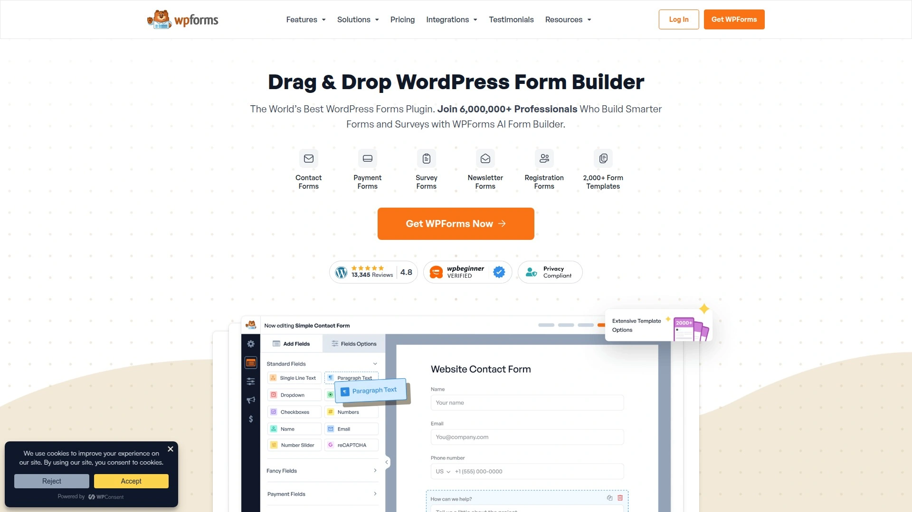
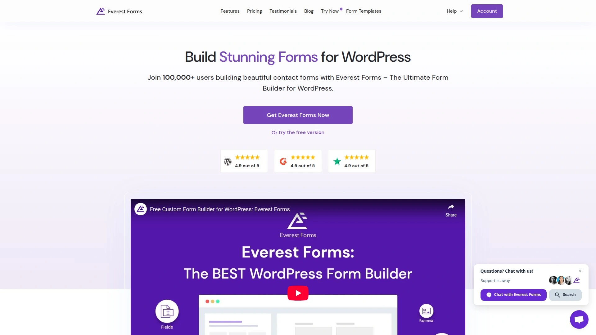
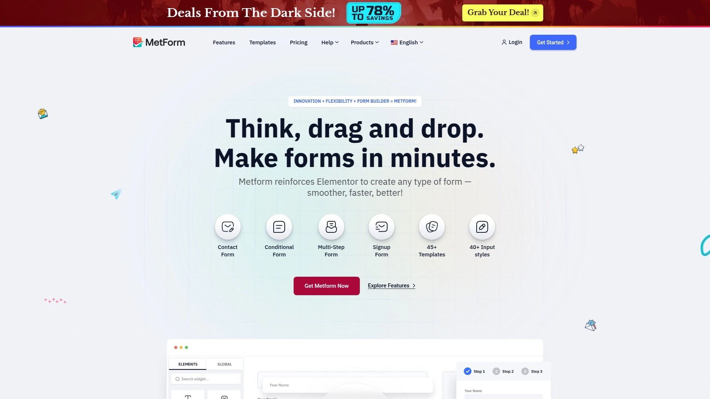
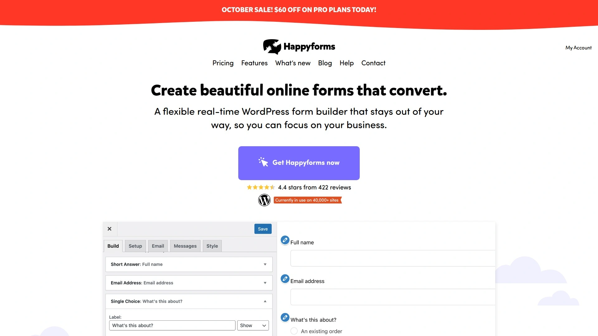

# Top 15 WordPress Form Builders Ranked in 2025 (Fresh Compilation)

If you're running a WordPress site, you already know forms are everywhere—contact pages, registration screens, payment checkouts, surveys. The right form builder makes this stuff painless. The wrong one? Well, you'll know it when you're wrestling with clunky interfaces at midnight. This list walks through 15 solid form builders that actually work, starting with the ones that'll handle your heaviest lifting and moving down to simpler options that still get the job done.

***

## **[Gravity Forms](https://www.gravityforms.com)**

The heavyweight champion for WordPress forms when complexity meets ease.

Gravity Forms has been around long enough to know what works. The drag-and-drop builder lets you throw together anything from a basic contact form to multi-page registration systems with conditional logic that shows or hides fields based on what users select. It's built for people who need power without wanting to touch code.

What makes it stand out is how it handles the technical stuff. You get 30+ field types right out of the box—standard inputs, file uploads, digital signatures, product pricing fields, quiz components. The conditional logic system means you can create forms that actually think, revealing relevant questions based on previous answers instead of bombarding everyone with everything.

The plugin includes built-in entry management where you can view, search, filter, and export submissions directly in WordPress. Email notifications route automatically to whoever needs them. Forms work on any device size, breaking longer forms into multiple pages so people don't get overwhelmed. For businesses dealing with payment processing, calculations, or user registration, Gravity Forms delivers without requiring a developer on speed dial.

Pricing starts at $59 annually for one site with basic features, scaling up to $259 for unlimited sites with advanced capabilities like surveys, polls, and Stripe integration.

***

## **[WPForms](https://wpforms.com)**

Beginner-friendly powerhouse with 2,000+ templates that actually look good.

WPForms wins on sheer ease of use. The interface feels like it was designed by someone who remembers what it's like to not know what you're doing. You pick a template from nearly 2,000 options, drag fields around until it looks right, and you're done. The free version handles simple contact forms perfectly, while premium plans unlock payment gateways, email marketing integrations, and survey tools.

The smart conditional logic keeps forms from feeling like interrogations. Show a shipping address field only when someone selects physical delivery. Reveal industry-specific questions based on what business type they choose. It feels natural instead of mechanical.

WPForms integrates smoothly with email services like Mailchimp and AWeber, payment processors like PayPal and Stripe, and CRM systems like Salesforce. File uploads work without drama. Spam protection comes standard. Multi-page forms with progress bars keep completion rates higher than single-page walls of questions.

The free WPForms Lite version works for basic needs. Premium pricing starts at $49.50 annually for one site, going up to $299.50 for unlimited sites with premium integrations and advanced features.

---

## **[Formidable Forms](https://formidableforms.com)**

The Swiss Army knife—if you can imagine it, this thing can probably build it.

Formidable Forms markets itself as more than a form plugin, and honestly, they're not exaggerating. People use it to build entire web applications inside WordPress. Registration systems, calculation forms, interactive surveys, front-end post submission, repeating fields for complex data entry—it handles stuff other plugins don't even attempt.

The drag-and-drop builder looks standard until you start digging into what's possible. Calculated fields perform math in real-time. Conditional logic works at multiple levels. You can create forms that save partially completed entries, let users edit their submissions later, or display submitted data in custom views on your site.

For developers, it's a playground. For non-developers, the learning curve is steeper than simpler plugins, but the payoff is forms that do exactly what you need without compromise. Quiz grading works automatically. Payment integrations with multiple processors come standard. The relationship features let you connect form data in ways that feel more like database management than form building.

Premium pricing starts around $39.50 annually. The free version gives you enough to test whether you want to commit to learning its more advanced features.

***

## **[Fluent Forms](https://fluentforms.com)**

Fastest loading times, cleanest code, 70+ templates that don't bog down your site.

Fluent Forms built its reputation on speed. While other form plugins can slow page loads, Fluent Forms keeps things lightweight without sacrificing features. The drag-and-drop builder feels responsive, with 40+ input field types and six different container options for organizing complex layouts.

The conversational form option creates one-question-at-a-time experiences that feel more like chatting than filling out paperwork. Completion rates tend to go up when people don't see 20 questions staring at them from the start. Multi-step forms with progress tracking accomplish similar results for longer data collection.

Payment integrations work with Stripe, PayPal, Mollie, Razorpay, and Paystack. The visual data reporting gives you analytics without needing Google Sheets exports. Form scheduling lets you open and close submissions automatically—useful for limited-time registrations or event signups.

AI form building recently got added, where you describe what you need and it generates a working form as a starting point. Not perfect, but faster than starting from scratch. The free version includes surprisingly robust features. Premium plans start at $55 annually with all features available across all pricing tiers, which is cleaner than plugins that gate features by plan level.

***

## **[Ninja Forms](https://ninjaforms.com)**

Clean interface that doesn't intimidate, with extensibility for when you outgrow basics.

Ninja Forms focuses on user experience—both for form builders and form fillers. The backend interface uses clean design and clear labeling, making it easy to figure out what does what. Add fields, set up conditional logic, configure notifications, style the appearance. Nothing feels buried three menus deep.

The free core plugin handles standard contact forms and simple data collection. When you need more, the add-on system lets you expand capabilities without paying for features you won't use. Payment processing, layout options, multi-part forms, file uploads—each lives as a separate add-on you can enable as needed.

Forms render quickly and work reliably across devices. The submission management inside WordPress lets you review entries, export data, and track form performance. Email notifications route to multiple recipients with customizable content based on user selections.

Premium pricing starts at $99 annually. The modular add-on approach means you can start small and scale up as requirements grow, though costs can add up if you need many add-ons.

***

## **[Contact Form 7](https://wordpress.org/plugins/contact-form-7/)**

The simple, free workhorse that's been running WordPress contact forms since forever.

Contact Form 7 takes a different approach—no fancy drag-and-drop builder, just straightforward code-like syntax for creating forms. If you've used any markup language, it'll feel familiar. If you haven't, there's a small learning curve, but nothing impossible.

What it lacks in visual polish, it makes up in reliability. It's been around since 2007, running on millions of sites without drama. File upload support works fine. AJAX-powered submission means forms submit without page reloads. Integration with Akismet blocks spam automatically.

The plugin is completely free and maintained actively. For simple contact forms, feedback collection, or basic inquiries, it delivers without bloat. You won't get conditional logic, payment processing, or advanced features without third-party add-ons, but sometimes you just need a working contact form without overthinking it.

Form submissions can be tracked with analytics if you set that up. Multiple forms on different pages work without conflict. Customization requires CSS knowledge, but the plugin respects whatever styling you apply.

***

## **[Forminator](https://wordpress.org/plugins/forminator/)**

Free feature monster that includes polls, quizzes, payment forms, and doesn't charge extra for the good stuff.

Forminator comes from WPMU DEV and might be the most generous free form plugin available. Forms, polls with real-time results, BuzzFeed-style quizzes, calculation forms, payment collection—all in the free version. Most plugins lock this stuff behind premium tiers.

The drag-and-drop builder handles standard form creation smoothly. Multi-column layouts, conditional logic, file uploads, GDPR compliance features, 50+ style controls. Built-in integrations include HubSpot, Mailchimp, AWeber, Google Sheets, Slack, Trello, Zapier, and more.

Polls create engagement that static content can't match. Quizzes drive traffic and social sharing when you make them shareable. The payment integrations with Stripe and PayPal work without requiring premium upgrades. Calculation forms let you build quote generators, cost estimators, or booking systems that calculate totals in real-time.

The pro version adds Stripe subscriptions, PDF generation, geolocation, and autocomplete, but honestly, the free version already gives you more than many paid plugins. It's worth testing if you want maximum functionality without recurring costs.

***

## **[HubSpot Forms](https://wordpress.org/plugins/leadin/)**

Free CRM integration that turns form submissions into managed contacts automatically.

HubSpot Forms works differently because it's part of a larger ecosystem. Install the HubSpot WordPress plugin and you get form building that automatically syncs submissions into HubSpot CRM. Every person who fills out a form becomes a contact you can track, segment, and nurture through their customer journey.

The form builder lives inside HubSpot's interface, creating embedded forms you add to WordPress pages. Fields map to contact properties automatically. Progressive profiling means returning visitors see different questions than new ones, letting you gather more data over time without overwhelming anyone.

Email notifications, autoresponders, follow-up sequences—all manageable from the CRM dashboard. The free HubSpot tier includes forms, live chat, email marketing basics, and contact management for up to 1,000,000 contacts, which covers most small to medium businesses.

The catch is you're committing to the HubSpot ecosystem. If you already use or plan to use their CRM, it's incredibly powerful. If you just need standalone forms, other options make more sense. Paid HubSpot plans start at $15 monthly and scale up significantly for advanced marketing automation.

***

## **[JotForm](https://www.jotform.com)**

10,000+ templates with forms that work everywhere, not just WordPress.

JotForm isn't WordPress-specific, which is actually its strength. Build forms once and embed them anywhere—WordPress, static sites, social media, email campaigns. The form builder offers over 10,000 templates covering nearly every use case imaginable, from job applications to health intake forms to event registrations.

The drag-and-drop interface feels polished and fast. Conditional logic, calculations, electronic signatures, payment collection through 30+ processors, file uploads with generous storage limits. Forms collect responses even when internet connections drop, syncing once connectivity returns.

Automatic report generation turns submissions into visual dashboards without manual data crunching. The database feature organizes responses into tables you can filter and search. No-code apps let you build custom solutions around your forms without hiring developers.

The free plan supports basic forms with 100 monthly submissions. Paid plans start at $34 monthly ($408 annually) with higher submission limits and advanced features. The Bronze and Silver tiers ($39-49 monthly) unlock most capabilities small businesses need.

***

## **[Typeform](https://www.typeform.com)**

Beautiful conversational forms that feel more like chatting than data entry.

Typeform pioneered the one-question-at-a-time format that reduces cognitive load and increases completion rates. Instead of facing a wall of fields, users answer one question, then another appears. It feels like conversation rather than interrogation, which matters when you're asking for personal or detailed information.

The interface design is gorgeous—smooth transitions, thoughtful animations, clean typography. Templates exist for every scenario, but the builder encourages customization to match your brand. Logic jumps create different paths based on responses, personalizing each user's experience.

Integration options connect to thousands of apps through Zapier, Make, and native connections. Payment collection works through Stripe. Hidden fields pass data from URLs for tracking campaign sources. Video and image embedding makes forms more engaging than pure text.

The free plan limits forms to 10 questions and 10 monthly responses, which is restrictive. Paid plans start at $25 monthly ($300 annually) for 100 responses, scaling up significantly for higher volumes. It's pricier than WordPress-native solutions but delivers an experience that stands apart visually and functionally.

***

## **[Everest Forms](https://everestforms.net)**

Lightweight, fast, and compatible with every page builder without conflicts.

Everest Forms built itself around compatibility. It works seamlessly with Elementor, Gutenberg, Beaver Builder, Divi—basically any page builder you're already using. No conflicts, no weird rendering issues, just forms that integrate smoothly wherever you need them.

The drag-and-drop builder keeps things simple without feeling limiting. Standard field types, multi-column layouts, conditional logic, file uploads, spam protection through reCAPTCHA and hCaptcha. Email notifications route to multiple recipients. Entries store in WordPress for easy access and CSV export.

Recent updates added AI capabilities for generating email notifications and chatbot-style interactions. Form styling options let you customize colors, fonts, spacing, and borders without touching CSS. Templates provide starting points for common use cases.

The free version covers basic contact forms and data collection. Premium features include payment integrations, advanced fields, PDF exports, user registration, calculations, and more. Pricing isn't publicly listed but positioned as accessible for small businesses and freelancers.

***

## **[MetForm](https://wpmet.com/plugin/metform/)**

Elementor-specific form builder with 30+ templates and reusable field groups.

MetForm exists specifically for Elementor users, which lets it integrate tighter than general-purpose plugins. Each form field is an Elementor widget, meaning you build forms using the same interface you design pages. No context switching, no learning new tools.

The standout feature is reusable field groups—create a common set of fields once (like name, email, phone) and insert them into any form with one click. Multi-step forms, conditional logic, calculations, payment collection through Stripe and PayPal, integration with email marketing services.

Templates cover volunteer applications, event registrations, loan applications, restaurant reservations, admission forms, WooCommerce checkout customization. The demo forms give beginners working examples to modify rather than starting from scratch.

Over 500,000 sites use MetForm, which speaks to its reliability within the Elementor ecosystem. The free version handles most standard form needs. Premium pricing unlocks additional integrations, advanced fields, and features like submission limitations and form scheduling.

***

## **[Quform](https://www.quform.com)**

Premium builder focused on theming and visual customization with 11 included styles.

Quform takes form aesthetics seriously. The plugin includes 11 pre-designed themes you can apply with one click, then customize further with detailed style controls. The split-screen preview shows real-time changes as you build, with adjustable sizing to check mobile responsiveness before publishing.

The builder offers 19 element types—standard inputs, dropdown menus, multi-select boxes, date pickers, time selectors, file uploads. Multi-page forms with conditional page display keep complex data collection organized. Auto-complete and default values speed up form completion for returning users.

Backend features include spam filtering through honeypot, image-based CAPTCHA, or reCAPTCHA methods. Form entries display in WordPress dashboard with labeling systems for organization. Import and export functionality moves forms between sites easily.

Quform is premium-only at CodeCanyon for $29 one-time with six months of support. It's been maintained since 2011 with consistent updates, achieving over 22,000 downloads and 4.7/5 average rating. Good value for anyone prioritizing form appearance and quick theming without CSS work.

***

## **[Happy Forms](https://happyforms.io)**

Optimized for conversations with clean design and one-click spam prevention.

Happy Forms approaches form building as conversation optimization—how do you increase quality interactions with website visitors? The plugin emphasizes reliable message delivery, spam prevention without frustrating real users, and mobile-responsive design that works across devices.

The drag-and-drop builder includes live preview so you see exactly how forms will look before publishing. Multi-column layouts create with single clicks. Confirmation messages and emails keep users informed. HoneyPot spam prevention works invisibly without requiring users to prove they're human.

Over 50 built-in style controls let you customize appearance to match site design. Forms work with Gutenberg, appearing as blocks you can place anywhere. Unlimited forms, fields, emails, and submissions even in the free version, which is generous compared to plugins that limit submission counts.

GDPR and accessibility compliance comes standard. The free version handles most small business needs. Premium upgrade adds features like conditional logic, advanced integrations, and enhanced customization options. The focus stays on simplicity and reliability rather than overwhelming feature lists.

***

## **[JetFormBuilder](https://jetformbuilder.com)**

Gutenberg-native form builder that lives inside the block editor natively.

JetFormBuilder takes a different technical approach by building forms entirely in Gutenberg rather than using a separate interface. If you've embraced block editing, this feels natural. Each form element is a block you add, arrange, and style using familiar Gutenberg controls.

The functional yet simple builder creates everything from basic contact forms to advanced types with conditional logic, calculations, and payment collection. Style controls live in the block editor sidebar where you expect them. Multi-step forms, repeater fields, file uploads—standard features work through block-based interaction.

Integration with automation plugins like AutomatorWP connects form submissions to workflows—enroll users in courses, add memberships, trigger tags based on field values. Email notifications route based on conditional logic. Form entries store and export for record keeping and analysis.

The approach works best if you're already comfortable with Gutenberg and prefer staying in that environment. If you still use classic editor or prefer dedicated form builder interfaces, other options might feel more intuitive. Pricing and specific feature tiers vary based on license level.

***

## **[Piotnet Forms](https://piotnetforms.com)**

Highly customizable with 11KB combined CSS and JS load—seriously lightweight.

Piotnet Forms obsesses over performance. A standard form loads only 11KB of CSS and JavaScript combined, which means negligible impact on page speed. For sites where every millisecond of load time matters, this is significant.

Features include booking appointments, coupon code fields, distance calculations, image select fields, range sliders, input masking, preview submissions before finalizing, calculated fields with date math, address autocomplete through Google APIs. Payment processing integrates with PayPal, Stripe, and WooCommerce.

Advanced capabilities include user registration, login, and profile editing through forms. Signature capture works for documents requiring authorization. Repeater fields let users add multiple entries of the same data type (like multiple attendees for event registration). reCAPTCHA v3 runs invisibly without checkbox clicks.

The free version provides basic form building. Pro version unlocks advanced features, integrations, and conditional logic capabilities. It's less known than mainstream options but worth considering if form performance directly impacts conversion rates or site speed scores.

***

## FAQ

**Which form builder works best for accepting payments?**

Gravity Forms, WPForms Pro, and Formidable Forms handle payments reliably with built-in Stripe and PayPal integrations. Forminator includes payment processing in the free version, which is unusual. For WordPress-specific sites, WPForms makes payment setup straightforward without technical knowledge.

**Can I build multi-step forms with progress bars?**

Most premium form builders support multi-step forms with progress tracking. Gravity Forms, WPForms, Fluent Forms, and Formidable Forms all include this feature. Breaking long forms into multiple steps consistently improves completion rates by reducing initial overwhelm.

**Do these form builders work with email marketing services?**

Yes, most integrate with popular email services. WPForms and Fluent Forms connect easily to Mailchimp, AWeber, and Constant Contact. HubSpot Forms syncs directly with HubSpot CRM. Forminator includes integration with multiple services in the free version. Check specific plugin documentation for your preferred email service compatibility.

***

## Conclusion

Choosing a form builder comes down to matching features with your actual needs. [Gravity Forms](https://www.gravityforms.com) earns the top spot for handling complex requirements while staying user-friendly—conditional logic that actually works, payment processing without headaches, and enough field types to build practically anything. If you're running a business site where forms collect leads, registrations, or payments, it delivers the reliability and features that justify the cost.

For simpler needs, free options like Contact Form 7, Forminator, or Happy Forms work fine. The middle ground—WPForms, Fluent Forms, Formidable Forms—gives you premium capabilities at reasonable prices. Test the free versions first. You'll know quickly whether a builder feels right or fights you at every step.
